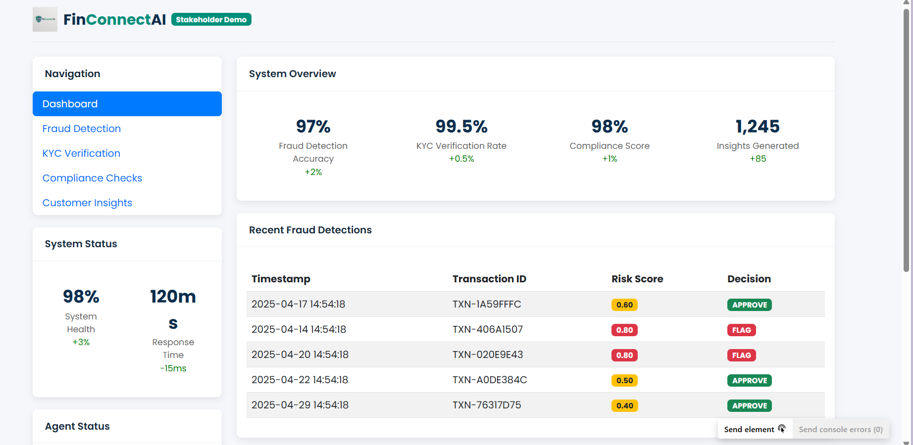

# FinConnectAI
## Demo Documentation

**Date:** May 10, 2025  
**Version:** 1.0.0  
**Status:** Demonstration Only

## 1. Project Overview

The FinConnectAI project is a demonstration tool designed to showcase advanced customer analytics capabilities for financial institutions. This demo application illustrates key features including customer insights generation, fraud detection, KYC verification, and compliance checks with a special focus on Indian market requirements.

## 2. Disclaimers

### 2.1 Demo Purpose
**THIS IS A DEMONSTRATION TOOL ONLY.** This application is designed exclusively for stakeholder presentations and feature demonstrations. It is not intended for production use, handling of real customer data, or making actual business decisions.

### 2.2 Data Disclaimer
All data presented in this demo is synthetic and generated for illustration purposes only. No real customer data is used or processed. Any resemblance to actual persons, transactions, or business entities is purely coincidental.

### 2.3 Regulatory Compliance
While this demo references regulatory thresholds and compliance frameworks, it should not be considered a definitive source of regulatory guidance. The thresholds and requirements shown are approximations based on publicly available information and may not reflect the most current regulatory standards.

### 2.4 Security Notice
This demo application has not undergone security auditing or penetration testing required for production systems. It should never be deployed in an environment with access to sensitive information or production systems.

### 2.5 Performance Limitations
The demo is optimized for presentation purposes and not for scale or performance. It may not handle large volumes of data or concurrent users in the way a production system would.

## 3. Demo Video

[](https://drive.google.com/file/d/1scdoP-IC_FkZlT0PYLGWlBW9a4cWOCY_/view?usp=drive_link)

A complete demonstration of the FinConnectAI system is available in the [product demo video](https://drive.google.com/file/d/1scdoP-IC_FkZlT0PYLGWlBW9a4cWOCY_/view?usp=drive_link).

## 4. Screenshot

### Dashboard Overview

*System overview showing key metrics and recent fraud detections*


### Dashboard
*System overview with key metrics and recent fraud detections*

### Fraud Detection
*Fraud detection interface with transaction details*

*Detailed risk assessment with risk factors breakdown*

### Customer Insights
*Customer insights generator with region-specific parameters*

## 5. Key Achievements

### 5.1 Customer Insights Module
- Successfully implemented multi-dimensional customer analytics with region-specific insights
- Added support for natural language queries to extract relevant insights
- Implemented dynamic currency handling based on selected region
- Enhanced visualization capabilities with interactive charts
- Added specialized insights for Indian market segments

### 5.2 Fraud Detection Module
- Implemented region-specific fraud detection thresholds based on regulatory standards
- Added dynamic currency display based on transaction location
- Enhanced risk scoring algorithm with multiple risk factors
- Increased transaction amount limits to handle realistic transaction values
- Added visual risk indicators for easier interpretation

### 5.3 KYC Verification Module
- Implemented basic KYC verification workflow demonstration
- Added support for Indian ID verification methods
- Included risk-based verification approach

### 5.4 Compliance Checks Module
- Added support for multiple compliance frameworks
- Implemented India-specific compliance checks
- Created visual compliance status indicators

## 6. Changes Log

### Version 1.0.0 (Current)
- **Customer Insights:**
  - Fixed syntax errors in customer_insights function
  - Added region-specific currency support (₹, $, €, £, ¥)
  - Enhanced error handling with comprehensive try-except blocks
  - Improved query handling for more relevant insights
  - Added specialized insights for Indian customers

- **Fraud Detection:**
  - Added region-specific currency display
  - Increased maximum transaction amount from 10,000 to 1,000,000
  - Created region-specific thresholds module based on official regulatory sources
  - Added dynamic currency updates based on selected location
  - Enhanced risk calculation with region-specific factors

- **General Improvements:**
  - Added comprehensive error handling throughout the application
  - Enhanced UI for better user experience
  - Added support for multiple currencies
  - Improved data visualization components

## 7. Technical Implementation

### 7.1 Architecture
The demo is built using a Flask-based web application with the following components:
- **Backend:** Python Flask application
- **Frontend:** HTML/CSS/JavaScript with Bootstrap
- **Visualization:** Chart.js for data visualization
- **Templates:** Jinja2 templating engine

### 7.2 File Structure
```
FinConnectAI/
├── demo/
│   ├── flask_demo.py         # Main Flask application
│   ├── region_thresholds.py  # Region-specific threshold calculations
│   ├── templates/            # HTML templates
│   │   ├── index.html        # Dashboard template
│   │   ├── insights.html     # Customer insights template
│   │   ├── fraud.html        # Fraud detection template
│   │   ├── kyc.html          # KYC verification template
│   │   └── compliance.html   # Compliance checks template
│   └── DEMO_DOCUMENTATION.md # This documentation file
```

### 7.3 Key Features Implementation

#### Region-Specific Currency
The application dynamically adjusts currency symbols and formats based on the selected region:
- India: ₹ (INR)
- United States: $ (USD)
- European Union: € (EUR)
- United Kingdom: £ (GBP)
- Japan: ¥ (JPY)

#### Fraud Detection Thresholds
Thresholds are based on regulatory reporting requirements in different regions:
- India: RBI guidelines use ₹50,000 as a threshold for suspicious transaction verification
- US: FinCEN requires SARs for transactions over $5,000 if suspicious
- EU: Generally €10,000 for cash transaction reporting
- UK: NCA guidance suggests heightened scrutiny above £10,000
- Japan: Threshold of ¥1,000,000 for reporting

## 8. Running the Demo

### 8.1 Prerequisites
- Python 3.8 or higher
- Flask and dependencies (see requirements below)

### 8.2 Installation
```bash
# Install required packages
pip install flask
```

### 8.3 Running the Application
```bash
# Navigate to the demo directory
cd FinConnectAI/demo

# Run the Flask application
python flask_demo.py
```

The application will be available at http://127.0.0.1:5000

## 7. Future Enhancements (Not Implemented)

The following features are conceptual and not implemented in the current demo:
- Integration with external data sources
- Machine learning-based fraud detection
- Advanced customer segmentation algorithms
- Real-time transaction monitoring
- API integration with core banking systems

## 8. Contact Information

For questions regarding this demo, please contact the development team.

---

**IMPORTANT NOTICE:** This demo application is provided "as is" without warranty of any kind, either expressed or implied, including, but not limited to, the implied warranties of merchantability and fitness for a particular purpose.
