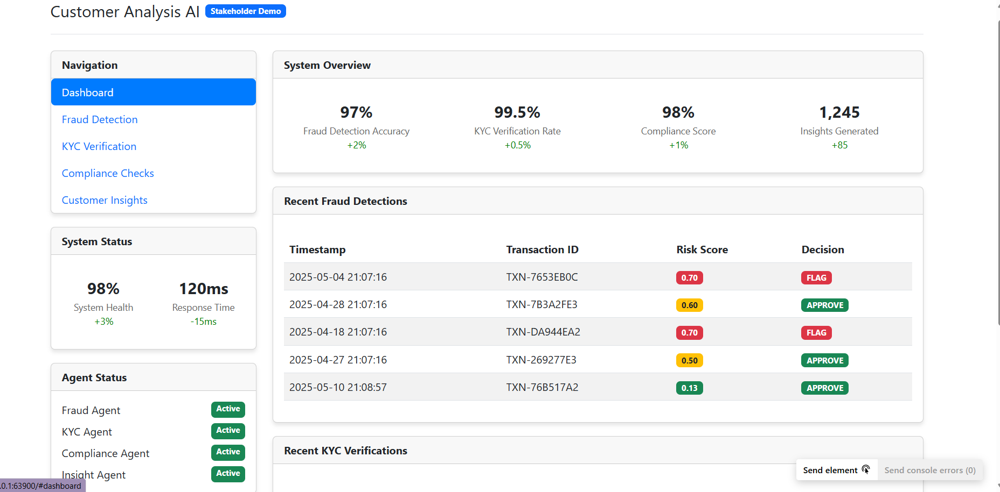
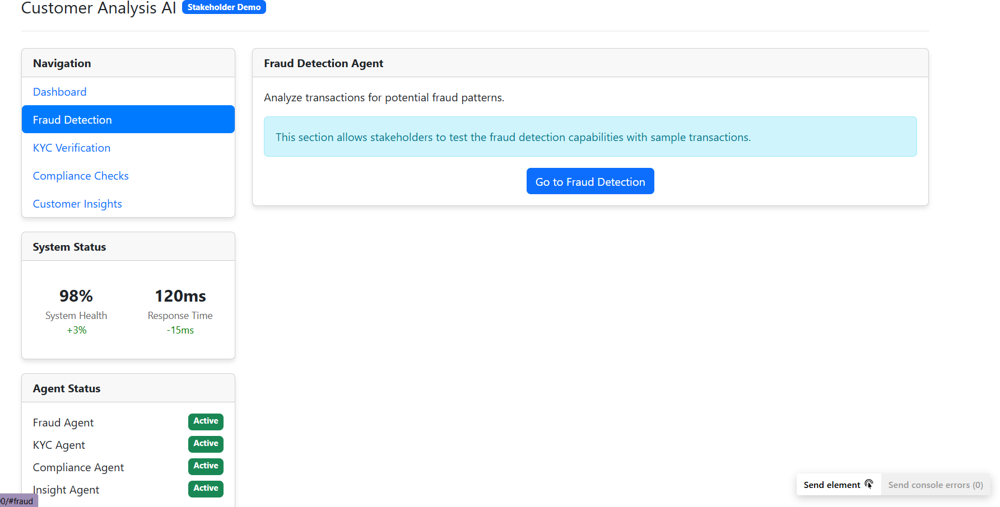
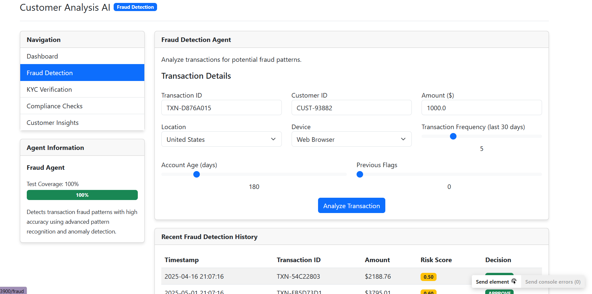
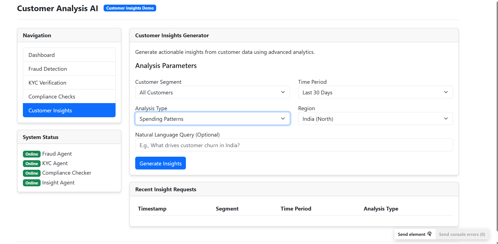

# FinConnectAI

## Overview

This project is a demonstration tool for showcasing advanced customer analytics capabilities for financial institutions, with a special focus on the Indian market. The demo illustrates key features including customer insights generation, fraud detection, KYC verification, and compliance checks.

## IMPORTANT DISCLAIMER

**THIS IS A DEMONSTRATION TOOL ONLY.** This application is designed exclusively for stakeholder presentations and feature demonstrations. It is not intended for production use, handling of real customer data, or making actual business decisions.

For full disclaimers, please see [DISCLAIMER.md](DISCLAIMER.md).

## Demo Video

[](https://drive.google.com/file/d/1JUsVbIQwu0H7QH8O_Aq-rX229xJOKPqq/view?usp=drive_link)

A complete demonstration of the FinConnectAI system is available in the [product demo video](https://drive.google.com/file/d/1JUsVbIQwu0H7QH8O_Aq-rX229xJOKPqq/view?usp=drive_link).

## Screenshots

### Dashboard

*System overview with key metrics and recent fraud detections*

### Fraud Detection

*Fraud detection interface with transaction details*


*Detailed risk assessment with risk factors breakdown*

### Customer Insights

*Customer insights generator with region-specific parameters*

## Features

### Customer Insights
- Multi-dimensional customer analytics with region-specific insights
- Natural language query support
- Dynamic currency handling based on selected region
- Interactive data visualization
- Specialized insights for Indian market segments

### Fraud Detection
- Region-specific fraud detection thresholds based on regulatory standards
- Dynamic currency display based on transaction location
- Enhanced risk scoring algorithm
- Support for high-value transactions
- Visual risk indicators

### KYC Verification
- KYC verification workflow demonstration
- Support for Indian ID verification methods
- Risk-based verification approach

### Compliance Checks
- Multiple compliance frameworks support
- India-specific compliance checks
- Visual compliance status indicators

## Getting Started

### Prerequisites
- Python 3.8 or higher
- Flask

### Installation
```bash
# Install required packages
pip install flask
```

### Running the Application
```bash
# Navigate to the demo directory
cd FinConnectAI/demo

# Run the Flask application
python flask_demo.py
```

The application will be available at http://127.0.0.1:5000

## Documentation

- [Demo Documentation](DEMO_DOCUMENTATION.md) - Comprehensive documentation of the demo
- [Changes Log](CHANGES_LOG.md) - Detailed list of changes and enhancements
- [Disclaimer](DISCLAIMER.md) - Important disclaimers and limitations

## Project Structure
```
FinConnectAI/
├── demo/
│   ├── flask_demo.py         # Main Flask application
│   ├── region_thresholds.py  # Region-specific threshold calculations
│   ├── templates/            # HTML templates
│   │   ├── index.html        # Dashboard template
│   │   ├── insights.html     # Customer insights template
│   │   ├── fraud.html        # Fraud detection template
│   │   ├── kyc.html          # KYC verification template
│   │   └── compliance.html   # Compliance checks template
│   ├── README.md             # This file
│   ├── DEMO_DOCUMENTATION.md # Comprehensive documentation
│   ├── CHANGES_LOG.md        # Detailed changes log
│   └── DISCLAIMER.md         # Important disclaimers
```

## Current Status

This demo is currently in version 1.0.0 and is ready for stakeholder presentations. All major features have been implemented with a focus on the Indian market requirements.

---

**IMPORTANT NOTICE:** This demo application is provided "as is" without warranty of any kind. See [DISCLAIMER.md](DISCLAIMER.md) for full details.
