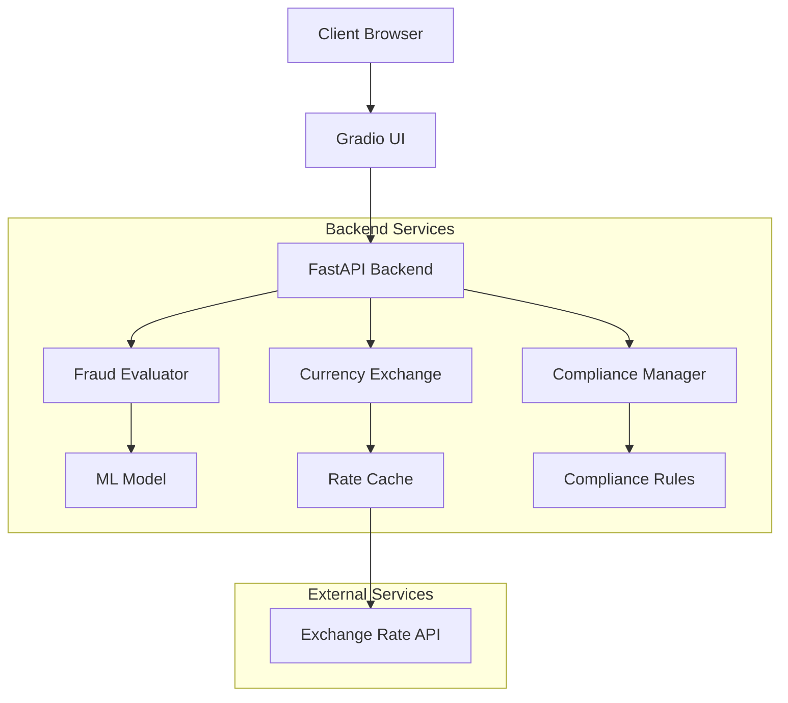
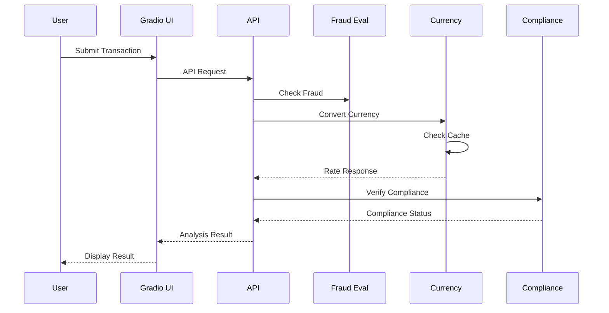
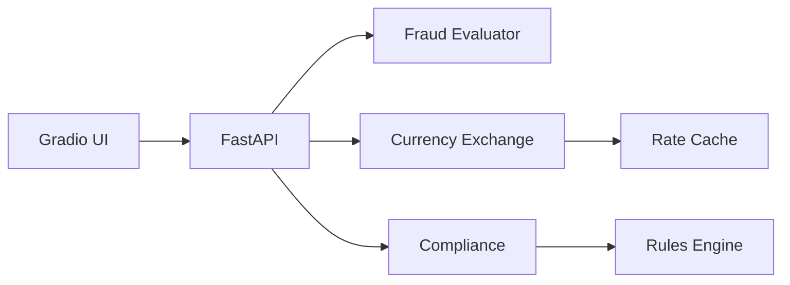

# FinConnectAI Architecture

## System Overview

FinConnectAI is a modular, microservices-based fraud detection system built with Python. It combines real-time transaction analysis, currency conversion, and regulatory compliance.

## Architecture Components

### 1. Core Services

#### Fraud Detection Service
- Located in `agents/fraud_agent.py`
- Real-time transaction analysis
- ML model integration
- Risk scoring and decision making

#### Currency Service
- Located in `app/currency_exchange.py` and `app/currency_cache.py`
- Real-time exchange rates
- Rate caching and updates
- Multi-currency support

#### Compliance Service
- Located in `app/compliance.py`
- Regulatory compliance checks
- Documentation generation
- Audit logging

### 2. API Layer

#### FastAPI Backend
- Located in `app/api_routes.py`
- RESTful API endpoints
- JWT authentication
- Rate limiting
- Request validation

### 3. User Interface

#### Gradio UI
- Located in `ui/gradio_fraud_explain.py`
- Interactive fraud analysis
- Real-time currency conversion
- Performance metrics visualization

### 4. Data Layer

#### Database
- PostgreSQL for persistent storage
- Redis for caching
- Transaction history
- Audit logs

## System Design

### Component Architecture


### Data Flow


### Component Dependencies


## Data Flow

1. **Transaction Analysis Flow**
   ```
   Client Request
   → API Gateway
   → Fraud Detection Service
   → ML Model Prediction
   → Compliance Check
   → Response Generation
   → Client Response
   ```

2. **Currency Conversion Flow**
   ```
   Rate Request
   → Cache Check
   → Exchange Rate API (if needed)
   → Rate Update
   → Cache Update
   → Response
   ```

## Security Architecture

### Authentication & Authorization
- JWT-based authentication
- Role-based access control
- API key management
- Request signing

### Data Security
- Encryption at rest
- TLS for data in transit
- Secure key storage
- Regular security audits

## Scalability

### Horizontal Scaling
- Stateless API design
- Load balancer ready
- Distributed caching
- Database sharding

### Performance Optimization
- Response caching
- Async operations
- Background tasks
- Rate limiting

## Monitoring & Logging

### System Monitoring
- Performance metrics
- Error tracking
- Resource usage
- API latency

### Audit Logging
- Transaction logs
- Security events
- Compliance checks
- System changes

## Deployment Architecture

### Docker Containers
```yaml
services:
  api:
    build: .
    ports:
      - "8000:8000"
    depends_on:
      - db
      - redis
  
  db:
    image: postgres:13
    volumes:
      - postgres_data:/var/lib/postgresql/data
  
  redis:
    image: redis:6
    volumes:
      - redis_data:/data
```

### Cloud Infrastructure
- Kubernetes orchestration
- Auto-scaling
- Load balancing
- Backup and recovery

## Development Workflow

### Version Control
- Feature branches
- Pull request reviews
- CI/CD pipeline
- Automated testing

### Testing Strategy
- Unit tests
- Integration tests
- Performance tests
- Security tests

## Future Enhancements

1. **Technical Improvements**
   - GraphQL API
   - WebSocket support
   - Enhanced caching
   - ML model updates

2. **Feature Additions**
   - Additional currencies
   - More fraud patterns
   - Advanced analytics
   - Mobile SDK

## References

- [FastAPI Documentation](https://fastapi.tiangolo.com/)
- [Gradio Documentation](https://gradio.app/docs/)
- [PostgreSQL Documentation](https://www.postgresql.org/docs/)
- [Redis Documentation](https://redis.io/documentation)
